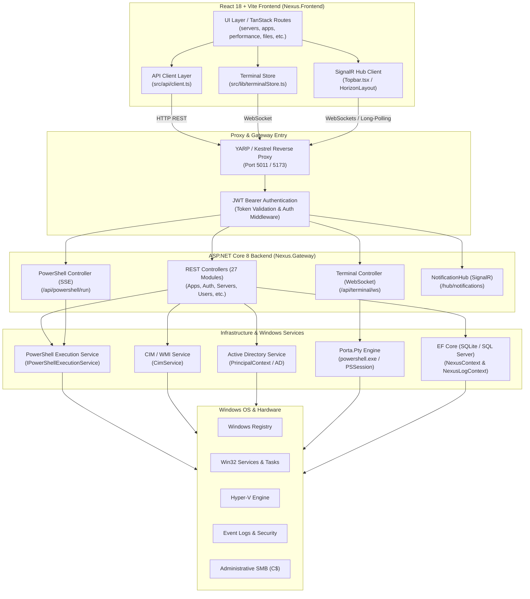
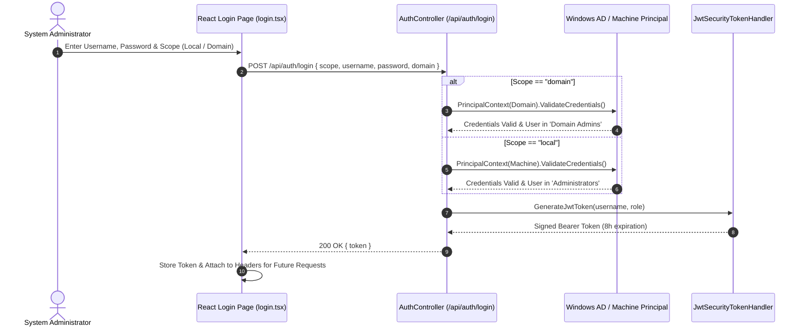
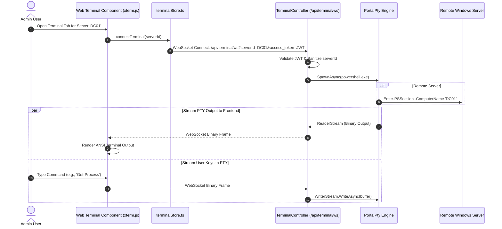
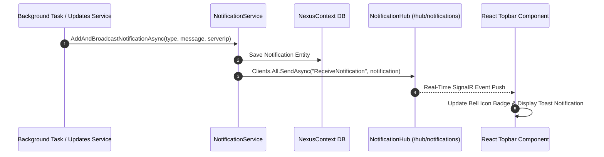

# NEXUS 🌌 Backend API & Frontend Integration Guide

This document provides complete technical documentation and visual architectural models for the **NEXUS** administration panel. It details how the **React 18 / Vite Frontend** communicates with the **ASP.NET Core 8 Backend Gateway (`Nexus.Gateway`)**, including REST API endpoints, WebSockets, Server-Sent Events (SSE), SignalR hubs, and native Windows integrations.

---

## 1. System Architecture & Visualization

### High-Level Architectural Flow

---

## 2. Real-Time Communication Sequence Diagrams

### A. Authentication Sequence (JWT Token Issuance)

---

### B. Interactive WebTerminal Flow (WebSocket + PTY)

---

### C. Live Notifications Sequence (SignalR)

---

## 3. Frontend-Backend API Integration Matrix

The following matrix documents all **28 API Modules**, their endpoint signatures, functionality, HTTP methods, payloads, backend implementations, and exact React route/component mappings.

| Domain | Controller Module | HTTP Endpoint Signature | Method | Description & Execution Logic | Frontend Component Integration |
|---|---|---|---|---|---|
| **Auth** | `AuthController` | `/api/auth/login` | `POST` | Authenticates against Local Admin or AD Domain Admins; returns JWT token. | `routes/login.tsx`, `routes/__root.tsx` |
| **Security** | `SecurityController` | `/api/servers/{ip}/security` | `GET` | Fetches Security Event logs, open TCP ports, local admins, and failed logons. | `routes/security.tsx` |
| **Servers** | `ServersController` | `/api/servers` | `GET` | Retrieves list of managed servers with status and telemetry. | `routes/servers.tsx`, `HorizonServers.tsx` |
| **Servers** | `ServersController` | `/api/servers` | `POST` | Adds a server manually to management inventory. | `routes/servers.tsx` |
| **Servers** | `ServersController` | `/api/servers/{ip}` | `PUT` | Updates existing server metadata. | `routes/servers.tsx` |
| **Servers** | `ServersController` | `/api/servers/{ip}` | `DELETE` | Removes server from management inventory. | `routes/servers.tsx` |
| **Servers** | `ServersController` | `/api/servers/{ip}/restart` | `POST` | Reboots server via CIM `Win32_OperatingSystem`. | `routes/servers.tsx`, `HorizonServers.tsx` |
| **Servers** | `ServersController` | `/api/servers/{ip}/shutdown` | `POST` | Shuts down server via CIM `Win32_OperatingSystem`. | `routes/servers.tsx`, `HorizonServers.tsx` |
| **Servers** | `ServersController` | `/api/servers/{ip}/disks` | `GET` | Queries physical disks via WMI/CIM. | `routes/storage.tsx` |
| **Performance**| `PerformanceController` | `/api/performance/{id}` | `GET` | Gets 60 telemetry samples (CPU, RAM, Disk, Net). | `routes/performance.tsx` |
| **Performance**| `PerformanceController` | `/api/performance/{id}/processes` | `GET` | Gets top CPU processes from DB telemetry. | `routes/performance.tsx` |
| **Performance**| `PerformanceController` | `/api/performance/{id}/processes/live` | `GET` | Queries live process list via CIM. | `routes/processes.tsx` |
| **Performance**| `PerformanceController` | `/api/performance/{id}/processes/{pid}` | `GET` | Gets process details by PID via CIM. | `routes/processes.tsx` |
| **Performance**| `PerformanceController` | `/api/performance/{id}/processes/{pid}` | `DELETE` | Terminates process via CIM `Win32_Process.Terminate()`. | `routes/processes.tsx` |
| **Devices** | `DevicesController` | `/api/servers/{serverId}/devices` | `GET` | Queries PnP hardware devices via PowerShell `Get-PnpDevice`. | `routes/devices.tsx` |
| **Terminal** | `TerminalController` | `/api/terminal/ws` | `WebSocket`| Real-time PTY PowerShell terminal stream (`Porta.Pty`). | `lib/terminalStore.ts` |
| **PowerShell**| `PowerShellController` | `/api/powershell/session` | `POST` | Creates persistent background PowerShell session. | `HorizonPowerShell.tsx` |
| **PowerShell**| `PowerShellController` | `/api/powershell/session/{id}`| `DELETE` | Destroys persistent PowerShell session. | `HorizonPowerShell.tsx` |
| **PowerShell**| `PowerShellController` | `/api/powershell/run` | `POST` | Streams PowerShell output via **Server-Sent Events (SSE)**. | `HorizonPowerShell.tsx` |
| **RDP** | `RdpController` | `/api/servers/{serverId}/rdp/sessions` | `GET` | Queries active RDP user sessions via `qwinsta`. | `routes/remote-desktop.tsx` |
| **RDP** | `RdpController` | `/api/servers/{serverId}/rdp/sessions/{id}/disconnect` | `POST` | Disconnects RDP session via `tsdiscon`. | `routes/remote-desktop.tsx` |
| **RDP** | `RdpController` | `/api/servers/{serverId}/rdp/sessions/{id}/logoff` | `POST` | Logs off RDP session via `logoff`. | `routes/remote-desktop.tsx` |
| **RDP** | `RdpController` | `/api/servers/{serverId}/rdp/sessions/{id}/message` | `POST` | Sends pop-up message to session user via `msg.exe`. | `routes/remote-desktop.tsx` |
| **RDP** | `RdpController` | `/api/servers/{serverId}/rdp/config` | `GET` / `PUT` | Reads & updates RDP security registry settings. | `routes/remote-desktop.tsx` |
| **Files** | `WindowsFilesController`| `/api/servers/{ip}/files/sources` | `GET` | Lists drive letters (`C:`, `D:`) & SMB shares. | `routes/files.tsx`, `RemoteFilePicker.tsx` |
| **Files** | `WindowsFilesController`| `/api/servers/{ip}/files/list` | `GET` | Browses folder contents over Administrative SMB (`C$`). | `routes/files.tsx`, `RemoteFilePicker.tsx` |
| **Files** | `WindowsFilesController`| `/api/servers/{ip}/files/new-folder` | `POST` | Creates folder on remote server. | `routes/files.tsx` |
| **Files** | `WindowsFilesController`| `/api/servers/{ip}/files/delete` | `DELETE` | Deletes file or directory on target server. | `routes/files.tsx` |
| **Files** | `WindowsFilesController`| `/api/servers/{ip}/files/upload` | `POST` | Uploads file up to 1GB to target path. | `routes/files.tsx`, `RemoteFilePicker.tsx` |
| **Files** | `WindowsFilesController`| `/api/servers/{ip}/files/download` | `GET` | Downloads file or streams folder as `.zip` archive. | `routes/files.tsx` |
| **Files** | `WindowsFilesController`| `/api/servers/{ip}/files/rename` | `POST` | Renames file/folder. | `routes/files.tsx` |
| **Files** | `WindowsFilesController`| `/api/servers/{ip}/files/move` | `POST` | Moves file/folder across volumes. | `routes/files.tsx` |
| **Files** | `WindowsFilesController`| `/api/servers/{ip}/files/copy` | `POST` | Copies file/folder recursively. | `routes/files.tsx` |
| **Files** | `WindowsFilesController`| `/api/servers/{ip}/files/read-text` | `GET` | Reads text file content. | `routes/files.tsx` |
| **Files** | `WindowsFilesController`| `/api/servers/{ip}/files/write-text`| `POST` | Overwrites text file content. | `routes/files.tsx` |
| **Storage** | `WindowsStorageController`| `/api/servers/{serverId}/storage/disks` | `GET` | Physical disk storage metrics (Health, BusType, Size). | `routes/storage.tsx` |
| **Storage** | `WindowsStorageController`| `/api/servers/{serverId}/storage/volumes`| `GET` | Volume storage metrics (FileSystem, FreeSpace). | `routes/storage.tsx` |
| **Active Directory** | `ActiveDirectoryController`| `/api/activedirectory/search` | `GET` | Searches AD users by SAM account name or display name. | `routes/users.tsx` |
| **Local Users**| `UsersController` | `/api/servers/{ip}/users` | `GET` | Lists local user accounts, last login, groups. | `routes/users.tsx` |
| **Local Users**| `UsersController` | `/api/servers/{ip}/users/groups` | `GET` | Lists local security groups and members. | `routes/users.tsx` |
| **Roles** | `RolesController` | `/api/servers/{ip}/roles` | `GET` | Queries Windows Features/Roles (`Get-WindowsFeature`). | `routes/roles.tsx` |
| **Roles** | `RolesController` | `/api/servers/{ip}/roles/install` | `POST` | Installs Windows role/feature. | `routes/roles.tsx` |
| **Roles** | `RolesController` | `/api/servers/{ip}/roles/uninstall` | `POST` | Uninstalls Windows role/feature. | `routes/roles.tsx` |
| **Services** | `WindowsServicesController`| `/api/servers/{serverId}/services` | `GET` | Lists Windows services via CIM `Win32_Service`. | `routes/services.tsx` |
| **Services** | `WindowsServicesController`| `/api/servers/{serverId}/services/{svc}/{act}` | `POST` | Controls service (`start`, `stop`, `restart`). | `routes/services.tsx` |
| **Tasks** | `TasksController` | `/api/servers/{ip}/tasks` | `GET` | Lists Scheduled Tasks (`schtasks /query`). | `routes/tasks.tsx` |
| **Tasks** | `TasksController` | `/api/servers/{ip}/tasks/run` | `POST` | Runs scheduled task on demand (`schtasks /run`). | `routes/tasks.tsx` |
| **Registry** | `RegistryController` | `/api/servers/{ip}/registry` | `GET` | Browses Windows Registry hives (`HKLM`, `HKCU`, etc.). | `routes/registry.tsx` |
| **Certificates**| `CertificatesController`| `/api/servers/{ip}/certificates` | `GET` | Lists digital certificates from LocalMachine store. | `routes/certificates.tsx` |
| **Networks** | `NetworksController` | `/api/servers/{ip}/networks` | `GET` | Network adapter IP, DNS, MAC, speed & throughput. | `routes/networks.tsx` |
| **Networks** | `NetworksController` | `/api/servers/{ip}/networks/{name}/{act}` | `POST` | Controls network adapter (`enable`, `disable`, `renew`). | `routes/networks.tsx` |
| **Apps** | `AppsController` | `/api/servers/{ip}/apps` | `GET` | Lists installed applications from Registry. | `routes/apps.tsx`, `SoftwareRepoManager.tsx` |
| **Apps** | `AppsController` | `/api/servers/{ip}/apps/install` | `POST` | Installs MSI/EXE package with SMB copy option. | `routes/apps.tsx` |
| **Apps** | `AppsController` | `/api/servers/{ip}/apps/upload-installer` | `POST` | Uploads installer up to 2GB to `C:\Windows\Temp`. | `routes/apps.tsx`, `RemoteFilePicker.tsx` |
| **Apps** | `AppsController` | `/api/servers/{ip}/apps/uninstall` | `POST` | Uninstalls app via uninstall string. | `routes/apps.tsx` |
| **Updates** | `UpdatesController` | `/api/servers/{ip}/updates` | `GET` | Gets cached missing Windows updates. | `routes/updates.tsx` |
| **Updates** | `UpdatesController` | `/api/servers/{ip}/updates/check` | `POST` | Searches for missing updates via COM searcher. | `routes/updates.tsx` |
| **Updates** | `UpdatesController` | `/api/servers/{ip}/updates/install` | `POST` | Triggers background download and installation. | `routes/updates.tsx` |
| **Hyper-V** | `VmsController` | `/api/servers/{serverId}/vms` | `GET` | Lists Hyper-V VMs via `Get-VM`. | `routes/vms.tsx` |
| **Hyper-V** | `VmsController` | `/api/servers/{serverId}/vms/{vmId}/{act}` | `POST` | Controls VM (`start`, `stop`, `pause`, `resume`). | `routes/vms.tsx` |
| **Hyper-V** | `VmsController` | `/api/servers/{serverId}/vms/{vmId}` | `DELETE` | Removes Hyper-V VM (`Remove-VM -Force`). | `routes/vms.tsx` |
| **Hyper-V** | `VmsController` | `/api/servers/{serverId}/vswitches` | `GET` | Lists Hyper-V Virtual Switches. | `routes/vswitches.tsx` |
| **Plugins** | `PluginsController` | `/api/plugins` | `GET` / `POST` | Lists & creates automation plugins. | `routes/plugin.$id.tsx`, `HorizonPlugin.tsx` |
| **Plugins** | `PluginsController` | `/api/plugins/{id}/upload` | `POST` | Uploads script file with dangerous command filter. | `routes/plugin.$id.tsx` |
| **Plugins** | `PluginsController` | `/api/plugins/{id}/run` | `POST` | Executes plugin concurrently across target servers. | `routes/plugin.$id.tsx` |
| **Jobs** | `JobsController` | `/api/jobs` | `GET` | Lists background jobs and reads execution logs. | `routes/plugin.$id.tsx` |
| **SharePoint**| `SharePointSetupController`| `/api/plugins/SharePointSetup/execute` | `POST` | Runs automated SharePoint & SQL Server deployment. | `routes/sharepoint-setup.tsx` |
| **Settings** | `AppSettingsController` | `/api/settings` | `GET` / `POST` | Manages global app settings, themes, density & logs. | `routes/settings.tsx`, `HorizonSettings.tsx` |
| **Notifications**| `NotificationsController`| `/api/notifications` | `GET` / `DELETE`| Manages notifications DB entities. | `Topbar.tsx`, `routes/index.tsx` |
| **SignalR** | `NotificationHub` | `/hub/notifications` | `SignalR` | Real-time push notification broadcast. | `Topbar.tsx`, `HorizonLayout.tsx` |
| **Utils** | `UtilsController` | `/api/utils/test-url` | `POST` | Tests external URL reachability via HTTP HEAD/GET. | `lib/backend.ts` |
| **Health** | Minimal API | `/api/health` | `GET` | Anonymous backend health check (`{ status: "Healthy" }`).| `lib/backend.ts` |

---

## 4. Detailed Component & Integration Guide

### 1. Centralized API Client (`src/api/client.ts`)
The React application routes interact with backend REST endpoints through `src/api/client.ts`. Key wrapper helper functions include:
- `getServersClient()`, `addServerClient()`, `restartServerClient()`
- `getPerformanceHistoryClient()`, `getProcessesClient()`, `killProcessClient()`
- `getFilesSourcesClient()`, `getFilesListClient()`, `uploadFileClient()`, `downloadFileClient()`
- `getRolesClient()`, `installRoleClient()`, `uninstallRoleClient()`
- `getUpdatesClient()`, `checkUpdatesClient()`, `installUpdatesClient()`
- `getVmsClient()`, `controlVmClient()`, `deleteVmClient()`

### 2. Authentication Interceptor (`src/routes/__root.tsx`)
All HTTP requests triggered by TanStack Router or fetch clients pass through root interceptors:
- Token auto-injection: `Authorization: Bearer <jwtToken>`
- Automatic redirect to `/login` when receiving `401 Unauthorized` responses.
- Backend URL dynamic resolution (`/api/...` relative proxy or absolute gateway URL).

### 3. Real-time Terminal Store (`src/lib/terminalStore.ts`)
Handles multi-tab web terminal sessions:
- Maintains active WebSocket connection references.
- Auto-reconnects on transient network drops.
- Encodes ANSI key strings into Uint8Arrays before writing to WebSocket frames.

---

## 5. Summary & Verification

This guide covers all **28 backend controller modules**, SignalR real-time hubs, WebSocket PTY shell controllers, and their 1:1 frontend component bindings.

To test end-to-end connectivity locally:
1. Start the .NET Gateway: `cd src/Nexus.Gateway && dotnet run` (Listens on port `5011`).
2. Start the Vite Frontend: `cd src/Nexus.Frontend && npm run dev` (Listens on port `5173`).
3. Verify `/api/health` returns `200 OK` with `{ "status": "Healthy" }`.
